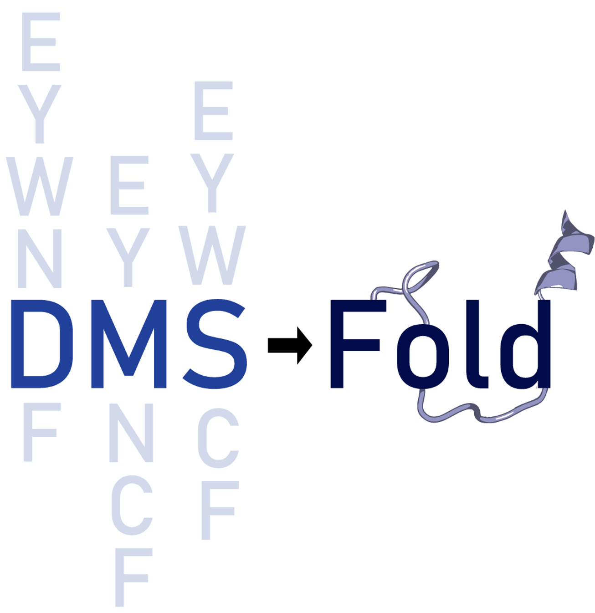

# DMS-Fold

[](https://huggingface.co/LindertLab/DMS-Fold/tree/main)       [](https://huggingface.co/datasets/LindertLab/dmsfold_training_set)      [](https://huggingface.co/datasets/LindertLab/megascale_casp14_cameo_sets)    [](https://doi.org/10.5281/zenodo.15793742)


DMS-Fold is a network which extracts burial information from deep mutational scanning data to enhance structure prediciton. It expands OpenFold with additional DMS-derived embeddings to the network's pair representation, informing about potential burial restraints.

The network currently only supports mutation ΔΔGs, not necessarily any metric of mutational fitness.

## Installation

DMS-Fold is a modified version of OpenFold. See [OpenFold's Documentation](https://openfold.readthedocs.io/en/latest/) for instructions on installing openfold dependencies and conda requirements.

DMS-Fold weights can be downloaded from https://huggingface.co/drake463/DMS-Fold/tree/main. The path to the weights can be specified via '--openfold_checkpoint_path', which by default is not set.

## Formatting DMS Input CSV

Single mutant deep mutational scanning thermodynamic stabilities (ΔΔGs) should be given as a CSV. The first column should correspond to the residue sequence number, the second being the wildtype residue one-letter-code, the third is the mutated residue, and the fourth being the measured ΔΔG for the corresponding mutation.

Sequence Number,WT-Residue,Mutated-Residue,ΔΔG

```bash
seq_n,wt_res,mut_res,ddG
1,M,A,-0.227
1,M,C,-0.109
1,M,D,-0.518
1,M,E,-0.053
1,M,F,0.734
```  

## Usage
DMS-Fold requires a protein sequence FASTA file, CSV with dms data, and the databases used by OpenFold for MSA/template information. A directory containing fastas files, and a corresponding directory containing matching dms CSVs should be specified. CSVs should start with the same name as the fasta file, with addition of '_dms.csv'. 
 
```bash
python3 predict_with_dmsfold.py \
    $INPUT_FASTA_DIR \
    $INPUT_DMS_DIR \
    $TEMPLATE_MMCIF_DIR \    
    --openfold_checkpoint_path openfold/resources/dmsfold_weights.pt \
    --uniref90_database_path uniref90.fasta \
    --mgnify_database_path mgy_clusters_2018_12.fa \
    --pdb70_database_path pdb70/pdb70 \
    --uniclust30_database_path uniclust30/uniclust30_2018_08/uniclust30_2018_08 \
    --bfd_database_path bfd/bfd_metaclust_clu_complete_id30_c90_final_seq.sorted_opt \
    --model_device "cuda:0" \
    --config_preset model_5_ptm
```
#### Required Arguments:
* `$INPUT_FASTA_DIR`: Directory of query fasta files, one sequence per file.
* `$INPUT_DMS_DIR`: Directory of dms CSVs corresponding to fasta files in '$INPUT_FASTA_DIR'
* `$TEMPLATE_MMCIF_DIR`: MMCIF files to use for template matching. This directory is required even though DMS-Fold peforms template-free inference.
* `*_database_path`: Paths to sequence databases for sequence alignment.
* `--model_device`: Specify to use a GPU if one is available.
* `--config_preset`: Must specify model_5_ptm when using DMS-Fold.

The use of MSA-subsampling can be specified with `--neff` and size-dependent neff can be specified with `--neff_size_dependent`

## Example
An example command with a provided fasta directory, dms directory, and precomputed alignments for 1PWT are located within the directory named 'example'. Expected outputs of relaxed and unrelaxed DMS-Fold predictions and feature pickle file are also provided. To enable deterministic predictions, a singular seed should be specified with '--seed.'

## Network Weights
The weights can be found on the [DMS-Fold model repository](https://huggingface.co/LindertLab/DMS-Fold/tree/main) on huggingface.co. Once downloaded, the weights should be added to DMS-Fold/openfold/resources/. The path to the weights can be specified with `--checkpoint_path'.

## Citing this work
If you use the code or data in this package, please cite:

```bibtex
@Article{DMS-Fold,
  author  = {Drake, Zachary and Day, Elijah and Toth, Paul and Lindert, Steffen},
  journal = {Nature Communications},
  title   = {Deep-learning structure elucidation from single-mutant deep mutational scanning},
  year    = {2025},
  volume  = {16},
  number  = {6874},
  doi     = {10.1038/s41467-025-62261-4}
}
```
